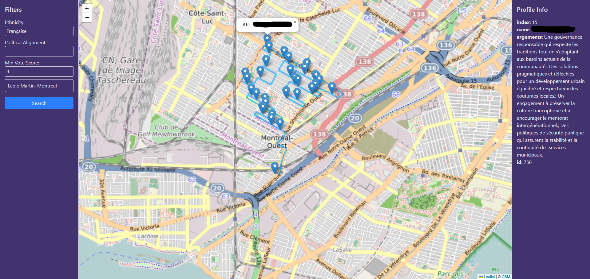

# Optimized Route Planner for Profile Visits

This project is a FastAPI-based tool that helps plan the most efficient route to visit a series of user profiles based on filtering criteria such as ethnicity, political alignment, or voting score. It leverages geolocation data, clustering, and real road optimization via the OpenRouteService API to return a highly usable, visually intuitive route map as well as providing useful insights regarding the profiles. The app's calls are accessible outside local network by using ngrok tunnels.

---
## Table of Contents 
- [Purpose](#purpose) 
- [Features](#features) 
- [Technologies Used](#technologies-used) 
- [Setup & Usage](#setup--usage)
- [Future Improvements](#future-improvements)


## Purpose

The purpose of this project is to:

- Filter and locate user profiles from a database according to user-defined criteria
- Plan an optimized real-road route starting from a given coordinate
- Visualize the path clearly with direction arrows and color-coded markers
- Handle large datasets efficiently by clustering the points when API limits are reached
- Allow an external user to connect and follow the route

---

## Features

### Database

- The original database used for this project is structured like so :

| Column Name            | Type            | Properties                            |
| ---------------------- | --------------- | ------------------------------------- |
| `UNIQUEID`             | string          | Primary Key, Unique                   |
| `NAME`                 | string          | Required                              |
| `FIRSTNAME`            | string          | Required                              |
| `AGE`                  | integer         | Nullable, Derived from BIRTHDATE      |
| `SECTION`              | string          | Nullable, Categorical                 |
| `NE`                   | integer         | Nullable                              |
| `CIRCONSCRIPT`         | string          | Electoral district, Nullable          |
| `PREFERRED_LANGUAGE`   | string          | ISO language code or full name        |
| `LANGUAGE`             | string          | Language spoken, Nullable             |
| `ORIGIN`               | string          | Ethnicity/National origin             |
| `PERSONNALITY`         | string          | Nullable, Could be MBTI or labels     |
| `BIRTHDATE`            | date            | Required if AGE not stored directly   |
| `GENRE`                | string          | Gender, expected values: M/F/X        |
| `HOME_PHONE`           | string          | Nullable, Optional                    |
| `SECOND_PHONE`         | string          | Nullable, Optional                    |
| `THIRD_PHONE`          | string          | Nullable, Optional                    |
| `MAIN_MAIL`            | string          | Email, Unique                         |
| `SECOND_MAIL`          | string          | Email, Nullable                       |
| `CIVIC`                | string          | Civic number/adress ID               |
| `APP`                  | string          | Apartment info, Nullable              |
| `STREET`               | string          | Street name                           |
| `STREET_TYPE`          | string          | e.g., Avenue, Rue, Blvd               |
| `CITY`                 | string          | Required                              |
| `CP`                   | string          | Postal Code                           |
| `ADRESS`               | string          | Full adress (may be redundant)       |
| `ANTICIPATED_VOTE`     | string          | Nullable, Expected vote               |
| `2017_RESULTS`         | string          | Nullable, Voting history              |
| `POLITICAL_PROFILE`    | string          | Nullable, Label or score range        |
| `POLITICAL_LEANING`    | string          | e.g., Left, Right, Center             |
| `INTERACTION_SEQUENCE` | string          | Nullable, List of interaction codes   |
| `VOTE_PROBABILITY`     | float (0.0–1.0) | Nullable, Model output                |
| `SUGGESTED_ARGUMENTS`  | string/json     | Nullable, Reasoning or talking points |
| `STRATEGIC_PROFILE`    | string          | Nullable, e.g., "swing voter", etc.   |
| `EXPLANATIONS`         | string/json     | Nullable, Additional reasoning        |

- And was reduced to a simpler one focusing on the most important aspects for the project :

| Column Name           | Type    | Properties                                                  |
| --------------------- | ------- | ----------------------------------------------------------- |
| `id`                  | integer | Primary Key, Auto-incremented                               |
| `uniqueid`            | string  | Unique, Not Null                                            |
| `name`                | string  | Nullable                                                    |
| `nbhood`              | string  | Not Null, Default = `"Loyola"`                              |
| `score_vote`          | integer | Nullable, Expected range: 1 to 5                            |
| `preferred_language`  | string  | Nullable                                                    |
| `native_language`     | string  | Nullable                                                    |
| `origin`              | string  | Nullable, Ethnic/cultural background                        |
| `political_lean`      | string  | Nullable, e.g., "Left", "Right", "Center"                   |
| `personality`         | string  | Nullable, could represent MBTI type or trait label          |
| `political_scale`     | text    | Nullable, may be serialized values or descriptive           |
| `ideal_process`       | string  | Nullable, preferred decision-making or political method     |
| `strategic_profile`   | string  | Nullable, e.g., "Undecided", "Mobilizable", "Committed"     |
| `suggested_arguments` | text    | Nullable, Argumentation points or notes                     |
| `picture_url`         | string  | Nullable, URL to the person's photo                         |
| `latitude`            | float   | Nullable, used for geolocation, computed from the adress    |
| `longitude`           | float   | Nullable, used for geolocation, computed from the adress    |
| `distance`            | float   | Nullable, calculated at runtime (e.g., from starting point) |

- The project contains tools to filter and export subsets of profiles, used notably to target certain profiles if the user decides to.

- Functions used to cleanup the original data and store it into an SQLite database, using `sqlalchemy`.

### Route Optimization

- Uses OpenRouteService's `/optimization` and `/directions` endpoints
- Starts from a user-defined location
- Handles up to 500 points with automatic batching and clustering if necessary

### Intelligent Batching

- Automatically clusters points when over 30 locations are passed
- Prevents API request overload while preserving geographic locality

### Interactive Mapping

- Uses Leaflet to display the resulting path on an interactive map
- Path animated using `AntPath`
- Start point highlighted in red
- Other markers colored in blue
- Markers are interactive, allowing the user to view the informations for each profile

### API Endpoint

- POST `/profiles/optimize`
  - Body parameters:

    ```json
    {
      "start_lat": 48.8566,
      "start_lon": 2.3522,
      "ethnicity": "Hispanic",
      "political_alignment": "left",
      "min_score_vote": 0.7
    }
    ```

---

## Technologies Used

### Backend :

```Python``` backend, provided by ```FastAPI```, using ```sqlalchemy``` for database management.
Route optimization made with ```ORS```.
Authentication using ```jwt``` and ```bcrypt```.
LLM implementation using ```Ollama```.

### Database :

```SQLite``` installation, interfaced with ```Python``` using ```sqlalchemy```.

### Frontend :

```React``` (```TypeScript```) and ```Tailwind``` built over ```Vite```.
Map display using ```Leaflet```.

---

### Networking :

```ngrok``` implementation exposes the local access to public URLs, allowing the user to connect remotely.
```batch``` launcher setupping the tunnels, updating the URLs and launching each part correctly.

```localhost:5173``` : frontend
```localhost:8000``` : backend

## Setup & Usage

0. **(Recommended) Setup a venv environment.**

    ```bash
    python -m venv .venv
    call .venv/Scripts/activate
    ```

1. **Install dependencies**

   ```bash
   pip install -r requirements.txt
   ```

   Note you'll need an API key from [OpenRouteService](https://openrouteservice.org/).

2. **Run the FastAPI app**

    The ```cli.py``` file is used to launch and manage the backend locally.

    ```bash
    uvicorn backend.cli:app --reload
    ```

3. **Using the backend**

    When prompted, select option 2 (create admin account).
    Enter your username and password.

    - *Use the endpoint (for backend testing)*

    Authenticate by calling ```/auth/login``` with the username and password defined.

    Send a POST request to ```/profiles/optimize``` with the filtering criteria

    It returns a GeoJSON of the optimized route

    A map is saved locally as ```route_map.html``` or ```clustered_map.html``` depending on the number of points.

    To visualize the route, open the file in a browser.

  **NB :** You can run the ```cli_tester.py``` file located in ```backend``` for easier use.

4. **Run the frontend app**

  The frontend can be launched using the ```ngrok_launcher.bat``` file. This will run the ```ngrok_tunneler.py``` file located under ```backend``` and setup the ngrok processes. The terminal will split into 3, allowing logging of the ngrok tunnels, python backend and vite frontend.

  To access the app, find in the ngrok terminal the URL redirecting to port ```5173``` : this is the frontend.

5. **Using the app**

  
  On the left of the page, you'll see a set of filtering options. Fill in some of the fields to select which part of the database to target. (Note that you can let any field blank to avoid filtering on them.)
  Make sure the values fit the ones inside the database. ("Français" != "Française") An autocompletion widget will appear when you select any of the fields, to ensure your value does exist.
  Then setup a starting adress or leave it blank to use your current position (will require access to your geolocation).
  Press ```Search``` and the process will start. The path should soon appear with the markers corresponding to each profile selected in your database. Click on one of them to display details on the right panel.

## Future Improvements

- User authentication and saved preferences

- Exportable map/report PDF

- Better marker clustering for extremely dense zones

- LLM insights enhancements, live base actualization
